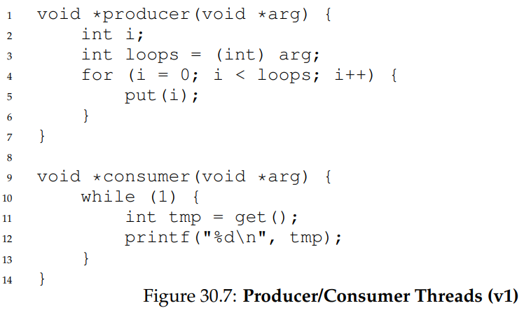

# 30. Condition Variables

Thus far we have developed the notion of a lock and seen how one can be properly built with the right combination of hardware and OS support. Unfortunately, locks are not the only primitives that are needed to build concurrent programs.

In particular, there are many cases where a thread wishes to check whether a condition is true before continuing its execution. For example, a parent thread might wish to check whether a child thread has completed before continuing (this is often called a join()); how should such a wait be implemented? Let’s look at Figure 30.1.

<figure><figcaption></figcaption></figure>

What we would like to see here is the following output:

```
parent: begin
child
parent: end
```

<figure><figcaption></figcaption></figure>

We could try using a shared variable, as you see in Figure 30.2. This solution will generally work, but it is hugely inefficient as the parent spins and wastes CPU time. What we would like here instead is some way to put the parent to sleep until the condition we are waiting for (e.g., the child is done executing) comes true.

## 30.1 Definition and Routines

To wait for a condition to become true, a thread can make use of what is known as a **condition variable**. A **condition variable** is an explicit queue that threads can put themselves on when some state of execution (i.e., some **condition**) is not as desired (by **waiting** on the condition); some other thread, when it changes said state, can then wake one (or more) of those waiting threads and thus allow them to continue (by **signaling** on the condition).

To declare such a condition variable, one simply writes something like this: `pthread_cond_t c;`, which declares c as a condition variable (note: proper initialization is also required). A condition variable has two operations associated with it: wait() and signal(). The wait() call is executed when a thread wishes to put itself to sleep; the signal() call is executed when a thread has changed something in the program and thus wants to wake a sleeping thread waiting on this condition. Specifically, the POSIX calls look like this:

```
pthread_cond_wait(pthread_cond_t *c, pthread_mutex_t *m);
pthread_cond_signal(pthread_cond_t *c);
```

We will often refer to these as wait() and signal() for simplicity. One thing you might notice about the wait() call is that it also takes a mutex as a parameter; it assumes that this mutex is locked when wait() is called. The responsibility of wait() is to release the lock and put the calling thread to sleep (atomically); when the thread wakes up (after some other thread has signaled it), it must re-acquire the lock before returning to the caller. This complexity stems from the desire to prevent certain race conditions from occurring when a thread is trying to put itself to sleep. Let’s take a look at the solution to the join problem (Figure 30.3) to understand this better.

<figure><figcaption></figcaption></figure>

There are two cases to consider. In the first, the parent creates the child thread but continues running itself (assume we have only a single processor) and thus immediately calls into thr\_join() to wait for the child thread to complete. In this case, it will acquire the lock, check if the child is done (it is not), and put itself to sleep by calling wait() (hence releasing the lock). The child will eventually run, print the message “child”, and call thr\_exit() to wake the parent thread; this code just grabs the lock, sets the state variable done, and signals the parent thus waking it. Finally, the parent will run (returning from wait() with the lock held), unlock the lock, and print the final message “parent: end”.

In the second case, the child runs immediately upon creation, sets done to 1, calls signal to wake a sleeping thread (but there is none, so it just returns), and is done. The parent then runs, calls thr join(), sees that done is 1, and thus does not wait and returns.

One last note: you might observe the parent uses a while loop instead of just an if statement when deciding whether to wait on the condition. While this does not seem strictly necessary per the logic of the program, it is always a good idea, as we will see below.

To make sure you understand the importance of each piece of the thr\_exit() and thr\_join() code, let’s try a few alternate implementations. First, you might be wondering if we need the state variable done. What if the code looked like the example below? (Figure 30.4)

<figure><figcaption></figcaption></figure>

Unfortunately this approach is broken. Imagine the case where the child runs immediately and calls thr\_exit() immediately; in this case, the child will signal, but there is no thread asleep on the condition. When the parent runs, it will simply call wait and be stuck; no thread will ever wake it. From this example, you should appreciate the importance of the state variable done; it records the value the threads are interested in knowing. The sleeping, waking, and locking all are built around it.

<figure><figcaption></figcaption></figure>

Here (Figure 30.5) is another poor implementation. The issue here is a subtle race condition. Specifically, if the parent calls thr\_join() and then checks the value of done, it will see that it is 0 and thus try to go to sleep. But just before it calls wait to go to sleep, the parent is interrupted, and the child runs. The child changes the state variable done to 1 and signals, but no thread is waiting and thus no thread is woken. When the parent runs again, it sleeps forever, which is sad.

### The Producer/Consumer (Bounded Buffer) Problem

The next synchronization problem we will confront in this chapter is known as the **producer/consumer** problem, or sometimes as the **bounded buffer** problem, which was first posed by Dijkstra. Indeed, it was this very producer/consumer problem that led Dijkstra and his co-workers to invent the generalized semaphore.

Imagine one or more producer threads and one or more consumer threads. Producers generate data items and place them in a buffer; consumers grab said items from the buffer and consume them in some way.

This arrangement occurs in many real systems. For example, in a multi-threaded web server, a producer puts HTTP requests into a work queue (i.e., the bounded buffer); consumer threads take requests out of this queue and process them.

Because the bounded buffer is a shared resource, we must of course require synchronized access to it, lest a race condition arise. To begin to understand this problem better, let us examine some actual code.

The first thing we need is a shared buffer, into which a producer puts data, and out of which a consumer takes data. Let’s just use a single integer for simplicity (you can certainly imagine placing a pointer to a data structure into this slot instead), and the two inner routines to put a value into the shared buffer, and to get a value out of the buffer. See Figure 30.6 for details.

<figure><figcaption></figcaption></figure>

Pretty simple, no? The put() routine assumes the buffer is empty (and checks this with an assertion), and then simply puts a value into the shared buffer and marks it full by setting count to 1. The get() routine does the opposite, setting the buffer to empty (i.e., setting count to 0) and returning the value. Don’t worry that this shared buffer has just a single entry; later, we’ll generalize it to a queue that can hold multiple entries, which will be even more fun than it sounds.

Now we need to write some routines that know when it is OK to access the buffer to either put data into it or get data out of it. The conditions for this should be obvious: only put data into the buffer when count is zero (i.e., when the buffer is empty), and only get data from the buffer when count is one (i.e., when the buffer is full). If we write the synchronization code such that a producer puts data into a full buffer, or a consumer gets data from an empty one, we have done something wrong (and in this code, an assertion will fire).

This work is going to be done by two types of threads, one set of which we’ll call the producer threads, and the other set which we’ll call consumer threads. Figure 30.7 shows the code for a producer that puts an integer into the shared buffer loops number of times, and a consumer that gets the data out of that shared buffer (forever), each time printing out the data item it pulled from the shared buffer.

<figure><figcaption></figcaption></figure>

### A Broken Solution

Now imagine that we have just a single producer and a single consumer. Obviously the put() and get() routines have critical sections within them, as put() updates the buffer, and get() reads from it. However, putting a lock around the code doesn’t work; we need something more.

Not surprisingly, that something more is some condition variables. In this (broken) first try (Figure 30.8), we have a single condition variable cond and associated lock mutex.

<figure><figcaption></figcaption></figure>

Let’s examine the signaling logic between producers and consumers. When a producer wants to fill the buffer, it waits for it to be empty (p1– p3). The consumer has the exact same logic, but waits for a different condition: fullness (c1–c3).&#x20;

With just a single producer and a single consumer, the code in Figure 30.8 works. However, if we have more than one of these threads (e.g., two consumers), the solution has two critical problems. What are they?

Let’s understand the first problem, which has to do with the if statement before the wait. Assume there are two consumers (Tc1 and Tc2) and one producer (Tp). First, a consumer (Tc1) runs; it acquires the lock (c1), checks if any buffers are ready for consumption (c2), and finding that none are, waits (c3) (which releases the lock).

Then the producer (Tp) runs. It acquires the lock (p1), checks if all buffers are full (p2), and finding that not to be the case, goes ahead and fills the buffer (p4). The producer then signals that a buffer has been filled (p5). Critically, this moves the first consumer (Tc1) from sleeping on a condition variable to the ready queue; Tc1 is now able to run (but not yet running). The producer then continues until realizing the buffer is full, at which point it sleeps (p6, p1–p3).

Here is where the problem occurs: another consumer (Tc2) sneaks in and consumes the one existing value in the buffer (c1, c2, c4, c5, c6, skipping the wait at c3 because the buffer is full). Now assume Tc1 runs; just before returning from the wait, it re-acquires the lock and then returns. It then calls get() (c4), but there are no buffers to consume! An assertion triggers, and the code has not functioned as desired. Clearly, we should have somehow prevented Tc1 from trying to consume because Tc2 snuck in and consumed the one value in the buffer that had been produced. Figure 30.9 shows the action each thread takes, as well as its scheduler state (Ready, Running, or Sleeping) over time.

<figure><figcaption></figcaption></figure>

The problem arises for a simple reason: after the producer woke Tc1, but before Tc1 ever ran, the state of the bounded buffer changed (thanks to Tc2). Signaling a thread only wakes them up; it is thus a hint that the state of the world has changed (in this case, that a value has been placed in the buffer), but there is no guarantee that when the woken thread runs, the state will still be as desired. This interpretation of what a signal means is often referred to as **Mesa semantics**, after the first research that built a condition variable in such a manner; the contrast, referred to as **Hoare semantics**, is harder to build but provides a stronger guarantee that the woken thread will run immediately upon being woken. Virtually every system ever built employs Mesa semantics.

### Better, But Still Broken: While, Not If

<figure><figcaption></figcaption></figure>

Fortunately, this fix is easy (Figure 30.10): change the if to a while. Think about why this works; now consumer Tc1 wakes up and (with the lock held) immediately re-checks the state of the shared variable (c2). If the buffer is empty at that point, the consumer simply goes back to sleep (c3). The corollary if is also changed to a while in the producer (p2).

Thanks to Mesa semantics, a simple rule to remember with condition variables is to always use while loops. Sometimes you don’t have to recheck the condition, but it is always safe to do so; just do it and be happy.

However, this code still has a bug, the second of two problems mentioned above. The problem occurs when two consumers run first (Tc1 and Tc2) and both go to sleep (c3). Then, the producer runs, puts a value in the buffer, and wakes one of the consumers (say Tc1). The producer then loops back (releasing and reacquiring the lock along the way) and tries to put more data in the buffer; because the buffer is full, the producer instead waits on the condition (thus sleeping). Now, one consumer is ready to run (Tc1), and two threads are sleeping on a condition (Tc2 and Tp).

The consumer Tc1 then wakes by returning from wait() (c3), re-checks the condition (c2), and finding the buffer full, consumes the value (c4). This consumer then, critically, signals on the condition (c5), waking only one thread that is sleeping. However, which thread should it wake?

Because the consumer has emptied the buffer, it clearly should wake the producer. However, if it wakes the consumer Tc2 (which is definitely possible, depending on how the wait queue is managed), we have a problem. Specifically, the consumer Tc2 will wake up and find the buffer empty (c2), and go back to sleep (c3). The producer Tp, which has a value to put into the buffer, is left sleeping. The other consumer thread, Tc1, also goes back to sleep. All three threads are left sleeping, a clear bug; see Figure 30.11 for the brutal step-by-step of this terrible calamity.

<figure><figcaption></figcaption></figure>

Signaling is clearly needed, but must be more directed. A consumer should not wake other consumers, only producers, and vice-versa.

### The Single Buffer Producer/Consumer Solution

The solution here is once again a small one: use two condition variables, instead of one, in order to properly signal which type of thread should wake up when the state of the system changes. Figure 30.12 shows the resulting code.

<figure><figcaption></figcaption></figure>

In the code, producer threads wait on the condition empty, and signals fill. Conversely, consumer threads wait on fill and signal empty. By doing so, the second problem above is avoided by design: a consumer can never accidentally wake a consumer, and a producer can never accidentally wake a producer.

### The Correct Producer/Consumer Solution

We now have a working producer/consumer solution, albeit not a fully general one. The last change we make is to enable more concurrency and efficiency; specifically, we add more buffer slots, so that multiple values can be produced before sleeping, and similarly multiple values can be consumed before sleeping. With just a single producer and consumer, this approach is more efficient as it reduces context switches; with multiple producers or consumers (or both), it even allows concurrent producing or consuming to take place, thus increasing concurrency. Fortunately, it is a small change from our current solution.

The first change for this correct solution is within the buffer structure itself and the corresponding put() and get() (Figure 30.13). We also slightly change the conditions that producers and consumers check in order to determine whether to sleep or not.

<figure><figcaption></figcaption></figure>

We also show the correct waiting and signaling logic (Figure 30.14). A producer only sleeps if all buffers are currently filled (p2); similarly, a consumer only sleeps if all buffers are currently empty (c2). And thus we solve the producer/consumer problem; time to sit back and drink a cold one.

<figure><figcaption></figcaption></figure>

## 30.3 Covering Conditions

We’ll now look at one more example of how condition variables can be used. This code study is drawn from Lampson and Redell’s paper on Pilot, the same group who first implemented the **Mesa semantics** described above (the language they used was Mesa, hence the name).

The problem they ran into is best shown via simple example, in this case in a simple multi-threaded memory allocation library. Figure 30.15 shows a code snippet which demonstrates the issue.

<figure><figcaption></figcaption></figure>

As you might see in the code, when a thread calls into the memory allocation code, it might have to wait in order for more memory to become free. Conversely, when a thread frees memory, it signals that more memory is free. However, our code above has a problem: which waiting thread (there can be more than one) should be woken up?

Consider the following scenario. Assume there are zero bytes free; thread Ta calls allocate(100), followed by thread Tb which asks for less memory by calling allocate(10). Both Ta and Tb thus wait on the condition and go to sleep; there aren’t enough free bytes to satisfy either of these requests.

At that point, assume a third thread, Tc, calls free(50). Unfortunately, when it calls signal to wake a waiting thread, it might not wake the correct waiting thread, Tb, which is waiting for only 10 bytes to be freed; Ta should remain waiting, as not enough memory is yet free. Thus, the code in the figure does not work, as the thread waking other threads does not know which thread (or threads) to wake up.&#x20;

The solution suggested by Lampson and Redell is straightforward: replace the pthread\_cond\_signal() call in the code above with a call to pthread\_cond\_broadcast(), which wakes up all waiting threads. By doing so, we guarantee that any threads that should be woken are. The downside, of course, can be a negative performance impact, as we might needlessly wake up many other waiting threads that shouldn’t (yet) be awake. Those threads will simply wake up, re-check the condition, and then go immediately back to sleep.

Lampson and Redell call such a condition a **covering condition**, as it covers all the cases where a thread needs to wake up (conservatively); the cost, as we’ve discussed, is that too many threads might be woken.

The astute reader might also have noticed we could have used this approach earlier (see the producer/consumer problem with only a single condition variable). However, in that case, a better solution was available to us, and thus we used it.

## 30.4 Summary

We have seen the introduction of another important synchronization primitive beyond locks: condition variables. By allowing threads to sleep when some program state is not as desired, CVs enable us to neatly solve a number of important synchronization problems, including the famous (and still important) producer/consumer problem, as well as covering conditions.
