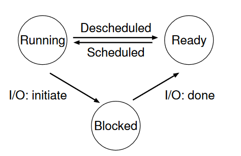

# 4. Processes

The definition of a process, informally, is quite simple: it is a running program

The OS creates the illusion of a nearly-endless supply of CPUs **virtualizing** the CPU.

By running one process, then stopping it and running another, and so forth, the OS can promote the illusion that many virtual CPUs exist when in fact there is only one physical CPU is known as **time sharing** of the CPU, allows users to run as many concurrent processes as they would like; the potential cost is performance, as each will run more slowly if the CPU(s) must be shared.

**Context switch**, which gives the OS the ability to stop running one program and start running another on a given CPU.

On top of these mechanisms resides some of the intelligence in the OS, in the form of policies. Policies are algorithms for making some kind of decision within the OS. For example, given a number of possible programs to run on a CPU, which program should the OS run? A scheduling policy in the OS will make this decision, likely using historical information (e.g., which program has run more over the last minute?), workload knowledge (e.g., what types of programs are run), and performance metrics (e.g., is the system optimizing for interactive performance, or throughput?) to make its decision.

## 4.1 The abstraction: a process

The abstraction provided by the OS of a running program is something we will call a **process**.

To understand what constitutes a process, we thus have to understand its machine state: what a program can read or update when it is running. At any given time, what parts of the machine are important to the execution of this program?

One obvious component of machine state that comprises a process is its **memory**. Instructions lie in memory; the data that the running program reads and writes sits in memory as well. Thus the memory that the process can address (called its **address space**) is part of the process.

Note that there are some particularly special registers that form part of this machine state. For example, the **program counter (PC)** (sometimes called the instruction pointer or IP) tells us which instruction of the program will execute next; similarly a **stack pointer** and **associated frame pointer** are used to manage the stack for function parameters, local variables, and return addresses.

Finally, programs often access **persistent storage devices** too. Such I/O information might include a list of the files the process currently has open

## 4.2 Process API

These APIs, in some form, are available on any modern operating system.

* **Create**: An operating system must include some method to create new processes.
* **Destroy**: As there is an interface for process creation, systems also provide an interface to destroy processes forcefully.
* **Wait**: Sometimes it is useful to wait for a process to stop running
* **Miscellaneous Control**: Other than killing or waiting for a process, there are sometimes other controls that are possible. For example, most operating systems provide some kind of method to suspend a process (stop it from running for a while) and then resume it (continue it running).
* **Status**: There are usually interfaces to get some status information about a process as well.

## 4.3 Process creation: a little more detail

The first thing that the OS must do to run a program is to load its code and any static data (e.g., initialized variables) into memory, into the address space of the process. Programs initially reside on disk (or, in some modern systems, flash-based SSDs) in some kind of executable format; thus, the process of loading a program and static data into memory requires the OS to read those bytes from disk and place them in memory somewhere.

In early (or simple) operating systems, the loading process is done eagerly, i.e., all at once before running the program; modern OSes perform the process lazily, i.e., by loading pieces of code or data only as they are needed during program execution. To truly understand how lazy loading of pieces of code and data works, you’ll have to understand more about the machinery of **paging** and **swapping**.

Once the code and static data are loaded into memory, there are a few other things the OS needs to do before running the process. Some memory must be allocated for the program’s **run-time stack** (or just **stack**). As you should likely already know, C programs use the stack for local variables, function parameters, and return addresses; the OS allocates this memory and gives it to the process. The OS will also likely initialize the stack with arguments; specifically, it will fill in the parameters to the main() function, i.e., argc and the argv array.

The OS may also allocate some memory for the program’s **heap**. In C programs, the **heap** is used for explicitly requested dynamically-allocated data; programs request such space by calling malloc() and free it explicitly by calling free(). The heap is needed for data structures such as **linked lists**, **hash tables, trees**, and other interesting data structures. The heap will be small at first; as the program runs, and requests more memory via the malloc() library API, the OS may get involved and allocate more memory to the process to help satisfy such calls.

The OS will also do some other initialization tasks, particularly as related to input/output (I/O).

By loading the code and static data into memory, by creating and initializing a stack, and by doing other work as related to I/O setup, the OS has now (finally) set the stage for program execution. It thus has one last task: to start the program running at the entry point, namely main().

## 4.4 Process States

In a simplified view, a process can be in one of three states:

**Running**: In the running state, a process is running on a processor. This means it is executing instructions.

**Ready**: In the ready state, a process is ready to run but for some reason the OS has chosen not to run it at this given moment.

**Blocked**: In the blocked state, a process has performed some kind of operation that makes it not ready to run until some other event takes place. A common example: when a process initiates an I/O request to a disk, it becomes blocked and thus some other process can use the processor.

 

<figure><figcaption></figcaption></figure>

## 4.5 Data Structures

To track the state of each process, for example, the OS likely will keep some kind of **process list** for all processes that are ready and some additional information to track which process is currently running.

A couple of important pieces of information the OS tracks about a process. The **register context** will hold, for a stopped process, the contents of its registers. When a process is stopped, its registers will be saved to this memory location; by restoring these registers (i.e., placing their values back into the actual physical registers), the OS can resume running the process. This is known as **context switch.**

Sometimes a system will have an **initial** state that the process is in when it is being created. Also, a process could be placed in a final state where it has exited but has not yet been cleaned up (**Zombie state**).

## 4.6 Summary

The **process** is the major OS abstraction of a running program. At any point in time, the process can be described by its state: the contents of memory in its **address space**, the contents of CPU registers (including the **program counter** and **stack pointer**, among others), and information about I/O (such as open files which can be read or written).

The **process API** consists of calls programs can make related to processes. Typically, this includes creation, destruction, and other useful calls.

Processes exist in one of many different **process states**, including running, ready to run, and blocked. Different events (e.g., getting scheduled or descheduled, or waiting for an I/O to complete) transition a process from one of these states to the other.

A **process list** contains information about all processes in the system. Each entry is found in what is sometimes called a **process control block (PCB)**, which is really just a structure that contains information about a specific process.
